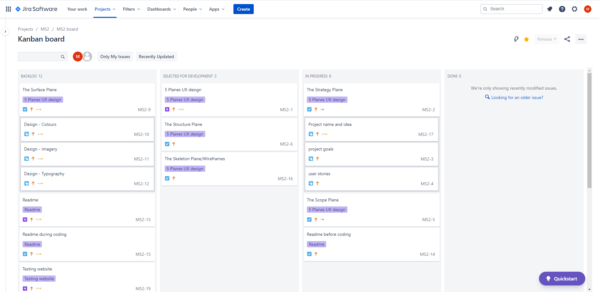

:globe_with_meridians: [Live website](https://mateuszniechwiej.github.io/MS-2-Quiz-game/)
# Table of Contest
- [Table of Contest](#table-of-contest)
- [Project Workflow](#project-workflow)
- [UX](#ux)
  - [The Strategy Plane](#the-strategy-plane)
    - [Project Goal](#project-goal)
    - [Site Goals](#site-goals)
    - [User Stories](#user-stories)
      - [New User](#new-user)
      - [Returning User](#returning-user)
  - [The Scope Plane](#the-scope-plane)
    - [Planed Features:](#planed-features)
  - [The Structure Plane](#the-structure-plane)
  - [The Skeleton Plane](#the-skeleton-plane)
    - [Wireframes](#wireframes)
  - [The Surface Plane](#the-surface-plane)
  - [Design](#design)
    - [Colour Scheme](#colour-scheme)
    - [Typography](#typography)
    - [Imagery](#imagery)
- [Features](#features)
  - [Existing Features:](#existing-features)
  - [Future Features:](#future-features)
- [Technologies Used](#technologies-used)
  - [Languages Used](#languages-used)
  - [Framework](#framework)
  - [Programmes and Libraries](#programmes-and-libraries)
- [Testing](#testing)
  - [CSS, HTML and JS Test](#css-html-and-js-test)
    - [CSS Validator - Test ...](#css-validator---test-)
    - [HTML Validator - Test...](#html-validator---test)
    - [JavaScript Validator - Test ...](#javascript-validator---test-)
  - [Browsers Testing](#browsers-testing)
  - [Performance](#performance)
  - [Colour Contrast](#colour-contrast)
  - [Functionality](#functionality)
  - [Issues](#issues)
- [Deployment](#deployment)
    - [This website was developed using GitPod and VSCode, with a repository hosted on GitHub.](#this-website-was-developed-using-gitpod-and-vscode-with-a-repository-hosted-on-github)
  - [Project Initiation](#project-initiation)
  - [Local Clone](#local-clone)
  - [GitHub Pages](#github-pages)
- [Credits](#credits)
  - [Code](#code)
  - [Media](#media)
    - [Images](#images)
  - [Acknowledgements](#acknowledgements)
  
- [Deployment](#deployment)
    - [This website was developed using GitPod and VSCode, with a repository hosted on GitHub.](#this-website-was-developed-using-gitpod-and-vscode-with-a-repository-hosted-on-github)
  - [Project Initiation](#project-initiation)
  - [Local Clone](#local-clone)
- [Credits](#credits)
  - [Code](#code)
  - [Media](#media)
    - [Images](#images)
  - [Acknowledgements](#acknowledgements)
  
  - [Colour Contrast](#colour-contrast)
  - [Functionality](#functionality)
- [Deployment](#deployment)
    - [This website was developed using GitPod and VSCode, with repository hosted on GitHub.](#this-website-was-developed-using-gitpod-and-vscode-with-repository-hosted-on-github)
  - [Project Initiation](#project-initiation)
  - [GitHub Pages](#github-pages)
  - [Local Clone](#local-clone)
- [Credits](#credits)
  - [Code](#code)
  - [Media](#media)
    - [Images](#images)
  - [Acknowledgements](#acknowledgements)
   
    
  - [CSS, HTML and JS Test](#css-html-and-js-test)
    - [CSS Validator - Test ...](#css-validator---test-)
    - [HTML Validator - Test...](#html-validator---test)
    - [JavaScript Validator - Test ...](#javascript-validator---test-)
  - [Browsers Testing](#browsers-testing)
    - [For Mobiles:](#for-mobiles)
    - [For Tablet:](#for-tablet)
    - [For Desktop:](#for-desktop)
  - [Performance](#performance)
  - [Colour Contrast](#colour-contrast)
  - [Functionality](#functionality)
- [Deployment](#deployment)
  - [Project Initiation](#project-initiation)
  - [Local Clone](#local-clone)
  - [GitHub Pages](#github-pages)
- [Credits](#credits)
  - [Code](#code)
  - [Media](#media)
  - [Images](#images)
  - [Acknowledgements](#acknowledgements)

# Project Workflow
* To organise the project work I used the JIRA project management tool:
  

  
  
# UX   

## The Strategy Plane
  ### Project Goal 
  The primary goal of this project is to create an easily navigated and entertaining Quiz Game for users of all age groups using Html, CSS and JavaScript.

  ### Site Goals
  * Create a fun quiz game to play.
  
  * Create a website fully responsive on mobiles, tablets, and desktop devices.
  
  * Provide logical structure which is easy to follow with clear instructions on "how to play") 
  
  * Create a game that the user would like to go back to with a user-friendly design.
  
  * Learn a variety of coding techniques by creating this game and use learnt skills in future projects.
  
  * A professional first project with the use of JavaScript to add to the portfolio.

  ### User Stories

  #### New User
   * As a new user, I want to understand the purpose of this website.

  * As a new user, I want to find clear instructions on how to play the game.

  * As a new user, I want to find an intuitive game with easy to see and press buttons.

  * As a new user, I want to be able to input my name to collect high scores.

  * As a new user, I want to be able to select the difficulty level of the game.

  * As a new user, I want to choose a quiz category.

  * As a new user, I want to be able to turn sound on/off anytime during the time I visit the website.

  * As a new user, I want to see the form of progress through the quiz.

  * As a new user, I want to be able to see if my answer was correct or false during the game.

  * As a new user, I want to get the final score of my quiz and be able to see my previous result.

  * As a new user, I want to be able to easily start a new quiz.

  * As a new user, I want to be able to contact the owner of the website and see if the developer created other projects I might be interested in.

#### Returning User
* As a returning user, I want to find new questions and quizzes.

## The Scope Plane 
  ### Planed Features:
  :black_square_button: Navigation header - Navigation header - A "sticky" navigation bar with 
  *  with sound icon on the left to turn off/on at any time 
  * Clear captions/logo on what the website is (Quiz Game)
  *  and an info icon on the right side of a navigation bar, the button will open modal with game instructions.
  
  :black_square_button: Game player name input field.

  :black_square_button: Last result.

  :black_square_button: Level of difficulty to select.

  :black_square_button: Quiz category to be selected.

  :black_square_button: Quiz progress information bar.

  :black_square_button: Correct answers score

  :black_square_button: Final score modal activating after answering the last question.

  :black_square_button: Footer with site owner info: 
  * GitHub icon - link to site owner GitHub profile
  * email link to contact the site owner.

## The Structure Plane
**Addressing user expectations**:
 > As a new user, I want to understand the purpose of this website.

A solution to satisfy user requirements:
  * "Sticky" navbar with Captions with name of the game.
  * Quiz question with four choices for each question in the active quiz area 

> As a new user, I want to be able to input my name to collect high scores.
A solution to satisfy user requirements:
  * When the website starts a modal to input name will be displayed unless the name already present in local storage(in this case player name will be automatically assigned from local storage). 

> As a new user, I want to find clear instructions on how to play the game.

A solution to satisfy user requirements:
  * info icon in the navbar- opens game instruction modal.

>  As a new user, I want to find an intuitive game with easy to see and press buttons.

A solution to satisfy user requirements:
  * All control buttons well-sized on all devices and easy to find.
> As a new user, I want to be able to select the difficulty level of the game

A solution to satisfy user requirements:
* Three buttons with difficulty level easy, medium, and hard. 

> As a new user, I want to choose a quiz category.

A solution to satisfy user requirements:
* Area to select a category before the quiz start.

> As a new user, I want to be able to turn sound on/off anytime during the time I visit the website.

A solution to satisfy user requirements:
* Sound icon located on a "sticky navbar" to turn off and on sound at any time while visiting the site.

> As a new user, I want to see the form of progress through the quiz.

A solution to satisfy user requirements:
* Progress bar located above quiz questions. 

> As a new user, I want to be able to see if my answer was correct or false during the game.

A solution to satisfy user requirements:
* After every question, the correct answer will have a green background on the button and the user wrong answer button will get the red background.
* Current score result displayed in the quiz section.

> As a new user, I want to get the final score of my quiz and be able to see my previous result.

A solution to satisfy user requirements:
* After the quiz finished a modal with the final score displayed.
* under player info result displays last quiz answers.

> As a new user, I want to be able to easily start a new quiz.

A solution to satisfy user requirements:
* After every game user will be easy to start again the game by choosing level difficulty again.

> As a new user, I want to be able to contact the owner of the website and see if the developer created other projects I might be interested in.

A solution to satisfy user requirements:
* In the footer GitHub icon linked to the GitHub username site provided.
* In the footer email link provided.

> As a returning user, I want to find new questions and quizzes.

A solution to satisfy user requirements:
* The [Open Trivia DB API](https://opentdb.com/api_config.php) used in this project to ensure a good number of question and categories available in the test. 

## The Skeleton Plane

### Wireframes

:point_right: [Wireframes for mobile and desktop](https://xd.adobe.com/view/f1ba91b2-e0a0-438a-a80e-afe3e5ae5ee1-a4e9/)

:point_right: [Wireframes - pdf] - to be added !!!!

## The Surface Plane
#
## Design

### Colour Scheme

### Typography

 :black_nib:

* The primary font used in this project is **Exo 2** with *sans-serif* as a fallback font. This font was chosen for this project because it gives a futuristic feeling while keeping an elegant design and delivering great readability.
* The secondary font used for this website is **Open Sans**  with *sans-serif* as a fallback font.This font is elegant and modern. It offers an excellent reading experience.

### Imagery

# Features

## Existing Features:

## Future Features:

:white_circle: - collections.

# Technologies Used

## Languages Used

  *  [HTML5](https://en.wikipedia.org/wiki/HTML5)

  *  [CSS3](https://en.wikipedia.org/wiki/CSS)

  * [JavaScript](https://pl.wikipedia.org/wiki/JavaScript)
 

## Framework

* [Bootstrap v.4.5.2](https://getbootstrap.com/) - used for layouts, styling and custom components such as navigation bar or image carousel.
 

## Programmes and Libraries

* [JIRA](https://www.atlassian.com/software/jira) - project management tool

* [Concepts](https://concepts.app/en/) - to create the first hand-drawn wireframe
  
* [Adobe Xd](https://www.adobe.com/ie/products/xd/wireframing-tool.html#:~:text=Adobe%20XD%20is%20a%20powerful,all%20in%20one%20design%20tool.) - for wireframe
* [Adobe Colour](https://color.adobe.com/create/color-wheel) - for colour palette used in this project.
* [Adobe Photoshop Express](https://photoshop.adobe.com/?promoid=SYBNM1DC&mv=other) - To crop the full page background image.
  
* [Google Fonts](https://fonts.google.com/)-

* [Font Awesome](https://fontawesome.com/) - 

* [Visual Studio Code](https://code.visualstudio.com/) - 

* [Github](https://github.com/) - used to host the project and deploy the live website through [Git Pages](https://pages.github.com/).

* [Chrome Developer Tools](https://developers.google.com/web/tools/chrome-devtools) - used to debug and test the website, and to ensure colour contrast

* [Lighthouse](https://developers.google.com/web/tools/lighthouse) - as a part of the chrome dev tool was used to improve the quality of the web page.

* [Favicon](https://favicon.io/) - to create a favicon for this Website.

* [online-audio-converter](https://online-audio-converter.com/) - to convert files to mp3.

# Testing

 

## CSS, HTML and JS Test

### CSS Validator - Test ...

### HTML Validator - Test...

### JavaScript Validator - Test ...

## Browsers Testing

## Performance

## Colour Contrast

## Functionality 
**Homepage**:

## Issues
    1.Encoding issue on some questions and answers fetched from Open Trivia API
  *  <del>partly resolved</del> 
  * <del>solution explanation - by using Base64 encoding ,and then use atob() to decode questions and choices.(impoved however some answers choices still wrongly disoplayed).</del>
  * resolved
  * solution explained - change to URL Encoding (3986) and then decode to display by using decodeURIComponent() .

    2.Add event listener to submit username Modal by pressing "Enter"
  *  resolved 

    3.Looking to find solution to alert user when category and difficulty not selected
  * resolved
    4. Background image not showing on android phones
  * not resolved ....

  
# Deployment

### This website was developed using GitPod and VSCode, with a repository hosted on GitHub.

## Project Initiation
 This project was created using the following steps:
1. Open Github in the browser and sign in to my account.
2. Click on **Repositories**
3. Press **New**
4. Choose [Code Institute Temple](https://github.com/Code-Institute-Org/gitpod-full-template)
5. Give **Repository** a name and description
6. Press **Create repository**.
7. Finally click on **Gitpod** button in the newly created repository to start working on this project.

## Local Clone
1. Navigating to the GitHub [Repository]
2. Click on **Code** green button.
3. Under the _Clone_ section, copy the URL from the HTTPS dialogue box.
4. Use the IDE of choice to open the terminal.
5. Use **git clone** command followed by the copied URL.
6. A clone of the project will now be created locally on your machine.   

## GitHub Pages
This website was published using [GitHub Pages](https://pages.github.com/) by:
1. Navigating to the GitHub [Repository](https://github.com/mateuszniechwiej/MS-2-Quiz-game)
2. Under the name of this project, there is a navigation bar - > Click on **Settings**.
3. Scroll down to the GitHub Pages Heading.
4. Under the _Source_ Choose **Branch: master*
5. Click the _Save_ button.
6. Click on the newly created link with the live page. (it can take a few minutes for the site to be published).
# Credits
* <a href="https://unsplash.com/photos/1_CMoFsPfso?utm_source=unsplash&utm_medium=referral&utm_content=creditShareLink">Unsplash-Joanna Kosinska</a> - Background for modal.
* <a href="https://www.vecteezy.com/free-vector/quiz">Quiz Vectors by Vecteezy</a>- icon downloaded to for favicon and game logo. 
* <a href="https://codepen.io/giana/pen/BZaGyP">Raise Button Effect</a> - use the efect for answer choices in the game.
* <a href="https://www.freepik.com/vectors/abstract">Abstract vector created by starline - www.freepik.com</a> - use for background image.
## Code

* [Bootstrap library](https://getbootstrap.com/) - used to create a responsive design

## Media
* Game no points scored sound [freesound](https://freesound.org/people/themusicalnomad/sounds/253886/);
* Game high score sound [freesound](https://freesound.org/people/plasterbrain/sounds/397353/)
* Game click sound [freesound](https://freesound.org/people/EminYILDIRIM/sounds/536108/)
* Game sounds for final win sound, correct and incorrect choices downloaded from [freesound](https://freesound.org/people/rhodesmas/sounds/320652/)
  

### Images

## Acknowledgements
* Udemy tutorial *"Build a Quiz App with HTML, CSS, and JavaScript"* created by James Quick
* [To learn how to use Bootstrap modals without jQuery](https://dev.to/ara225/how-to-use-bootstrap-modals-without-jquery-3475)
* [CSS-Tricks](https://css-tricks.com/perfect-full-page-background-image/) - learned how to find set up for full page background image.
* [css-tricks.com](https://css-tricks.com/couple-takes-sticky-footer/) - To learn how to keep the footer at the bottom of the page. 
* [JS30-"Drum_Kit"](https://javascript30.com/) -learned how to allow sound play after fast click next answer in Quiz.

